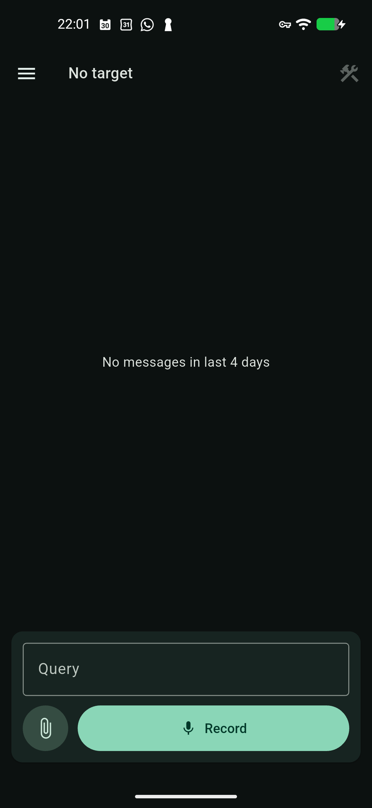
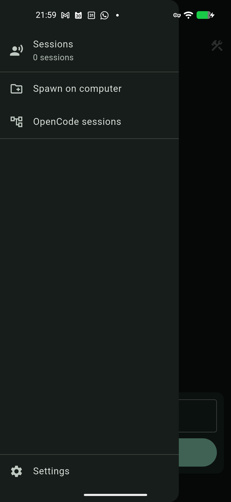
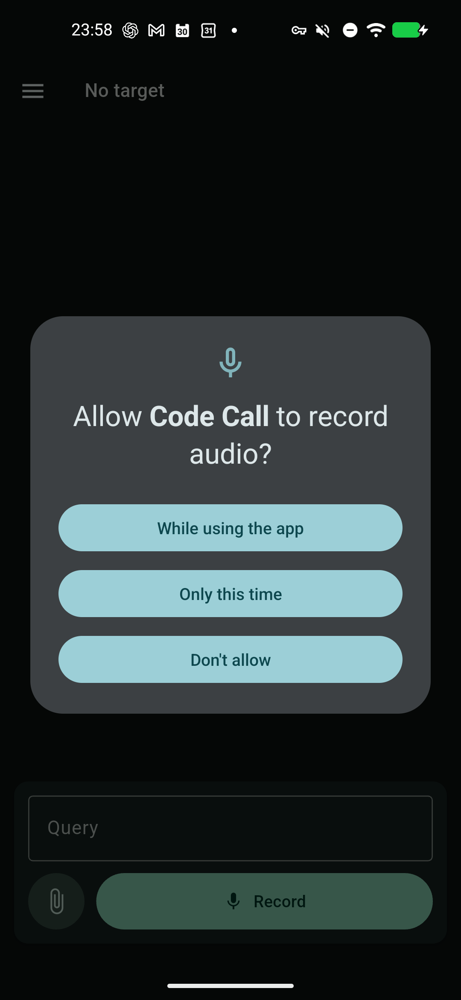

# Code Call

Android phone remote for OpenCode over encrypted Nostr GiftWrapped DMs.

Code Call lets a phone talk to an OpenCode worker running on a computer. You can type, record voice, attach files, switch repo sessions, inspect git state, request diffs, read files, and stop active tasks without opening a laptop.

## Screenshots

| Chat and Composer | Session Drawer | Voice Recording |
| --- | --- | --- |
|  |  |  |

## What It Does

- Sends typed requests to OpenCode through encrypted Nostr DMs.
- Records push-to-talk audio, encrypts it, uploads it to Blossom, and lets the worker transcribe it with Whisper.
- Supports encrypted file/media attachments through Blossom references.
- Stores multiple repo targets and routes each request to the selected workdir.
- Spawns or reopens repo workers from the phone through the session drawer.
- Picks OpenCode sessions for the active repo.
- Provides a mobile Tools menu for status, stop task, Git inspection, file reading, task history, model config, commit prep, and release workflow help.
- Renders responses as Markdown and can speak replies with Android TTS.

## Mobile UI

The main screen is a chat view with a composer at the bottom. Type in the query box and tap send, or leave it empty and tap `Record` for a voice request. The attachment button sends encrypted media/file references.

The session drawer contains:

- Saved repo sessions.
- Session pin/unpin.
- Recent-first session ordering.
- Session search.
- `Spawn on computer` opens a full-screen Create/Open selector with folder search and a large repository list.
- `OpenCode sessions` for choosing the OpenCode session attached to the selected repo.
- Settings for keys, relays, Blossom, speech, haptics, and profile import/export.

The Tools button in the top bar is enabled once connected. It sends optional worker requests instead of dumping details inline by default:

- `Session status`
- `Stop current task`
- `Git status`
- `File diff`
- `Read file`
- `Task history`
- `Model config`
- `Commit prep`
- `Release workflow`

Git status, file diffs, and file content open in dedicated mobile views:

- Git status groups changed files into staged, working, and untracked filters.
- Diff view provides a changed-file picker, previous/next navigation, line numbers, and colored additions/deletions.
- Read File opens a repository browser for readable files with folders, breadcrumbs, search, and file-type icons.
- File view provides line numbers, horizontal/vertical scrolling, selectable text, and find-in-file navigation.

## Security Model

- Text, transcripts, responses, attachment URLs, and decryption keys are inside NIP-17/NIP-59 encrypted GiftWrapped DMs.
- Blossom uploads are public blobs, but the uploaded payload is encrypted locally before upload.
- The worker only accepts the configured phone pubkey, or claims the first phone during pairing when no owner is configured.
- SQLite memory, if enabled, is local to the worker and contains decrypted request/response history.

## Install APK

Download the latest APK from GitHub Releases:

```text
https://github.com/tidley/nostr-codex-phone/releases
```

Install on Android, then scan the worker QR code or paste the worker target details in Settings. Keep the APK and worker on the same release version so structured tool views use the same wire contract.

## Start A Worker

From the directory you want to use as the worker root:

```bash
curl -fsSL https://raw.githubusercontent.com/tidley/nostr-codex-phone/main/scripts/bootstrap-worker.sh | bash
```

The worker writes state under `.nostr-codex/`, including `.env.server`, `target.svg`, `target.txt`, `workers.json`, `worker.lock`, and optional `memory.sqlite3`.

On startup it prints/saves a QR target card. Scan it from the phone to add the computer service or repo session.

## Worker Configuration

Common `.nostr-codex/.env.server` values:

```bash
NOSTR_SECRET_KEY='nsec...optional worker key...'
NOSTR_PEER_PUBKEY='npub...phone public key...'
NOSTR_RELAYS='wss://relay.damus.io,wss://nos.lol,wss://nostr.mom'

AGENT_BACKEND='opencode'
OPENCODE_URL='http://127.0.0.1:4096'
OPENCODE_BIN='opencode'
OPENCODE_AGENT='build'
OPENCODE_MODEL='openai/gpt-5.5'
AGENT_WORKDIR='/path/to/repo'

TRANSCRIBE_BIN='/home/user/.local/bin/whisper-cpp'
TRANSCRIBE_ARGS='-m /path/to/ggml-base.en.bin -f {audio} -otxt -of {output_dir}/transcript -nt'
```

With the default local OpenCode URL, the worker starts `opencode serve --hostname 127.0.0.1 --port 4096` if needed. For non-local URLs, start and secure OpenCode yourself.

## Development

Run the app:

```bash
flutter run
```

Run the worker:

```bash
cargo run --manifest-path rust/Cargo.toml --bin nostr-codex-server
```

Verify:

```bash
flutter analyze
cargo test --manifest-path rust/Cargo.toml -- --test-threads=1
flutter build apk --release
```

Package release assets:

```bash
cargo build --release --manifest-path rust/Cargo.toml --bin nostr-codex-server
scripts/package-release-assets.sh
```
