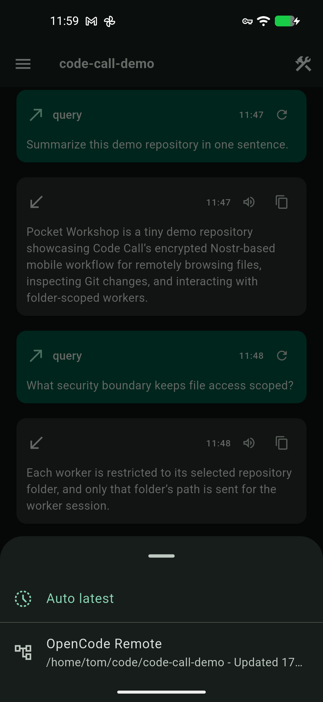

# Code Call

Android phone remote for OpenCode over encrypted Nostr GiftWrapped DMs.

Code Call lets a phone talk to an OpenCode worker running on a computer. You can type, record voice, attach files, switch repo sessions, inspect git state, request diffs, read files, and stop active tasks without opening a laptop.

## Screenshots

These screens were captured from a Pixel 5 connected to a temporary `code-call-demo` worker. The conversation, OpenCode session, repository files, and Git changes are real; no UI data was mocked.

| Encrypted chat | Session drawer | Spawn session |
| --- | --- | --- |
|  |  |  |

| OpenCode tools | Git status | Repository browser |
| --- | --- | --- |
|  |  |  |

| File viewer | OpenCode sessions | Settings |
| --- | --- | --- |
|  |  |  |

| Voice recording |
| --- |
|  |

### Feature Tour

- **Encrypted chat:** typed prompts and Markdown responses stay attached to the selected repository session, with resend, copy, read-aloud, and attachment actions.
- **Session drawer:** search, select, pin, rename, restart, or remove saved worker targets; connected and loaded states are visible at a glance.
- **Spawn session:** create a folder or search and open an existing repository through the computer service.
- **OpenCode sessions:** use the latest session automatically or bind the repository target to a specific OpenCode session.
- **Tools:** request status, stop work, inspect Git, read files, view history/configuration, prepare a commit, or start a release workflow.
- **Git status and diff:** filter staged, working, and untracked files, then inspect changed files with patch navigation and line numbers.
- **Repository browser:** navigate folders, search relative paths, and open readable files without typing a path.
- **File viewer:** inspect selectable, line-numbered content with horizontal scrolling and find-in-file navigation.
- **Voice and attachments:** record encrypted audio for Whisper transcription or send encrypted media/file references through Blossom.
- **Settings:** manage worker targets, local keys, relays, Blossom, TTS, haptics, profile import/export, and connection diagnostics.

## What It Does

- Sends typed requests to OpenCode through encrypted Nostr DMs.
- Records push-to-talk audio, encrypts it, uploads it to Blossom, and lets the worker transcribe it with Whisper.
- Supports encrypted file/media attachments through Blossom references.
- Stores multiple repo targets and routes each request to the selected workdir.
- Spawns or reopens repo workers from the phone through the session drawer.
- Picks OpenCode sessions for the active repo.
- Provides a mobile Tools menu for status, stop task, Git inspection, file reading, task history, model config, commit prep, and release workflow help.
- Renders responses as Markdown and can speak replies with Android TTS.

## Mobile UI

The main screen is a chat view with a composer at the bottom. Type in the query box and tap send, or leave it empty and tap `Record` for a voice request. The attachment button sends encrypted media/file references.

The session drawer contains:

- Saved repo sessions.
- Session pin/unpin.
- Recent-first session ordering.
- Session search.
- `Spawn on computer` opens a full-screen Create/Open selector with folder search and a large repository list.
- `OpenCode sessions` for choosing the OpenCode session attached to the selected repo.
- Settings for keys, relays, Blossom, speech, haptics, and profile import/export.

The Tools button in the top bar is enabled once connected. It sends optional worker requests instead of dumping details inline by default:

- `Session status`
- `Stop current task`
- `Git status`
- `File diff`
- `Read file`
- `Task history`
- `Model config`
- `Commit prep`
- `Release workflow`

Git status, file diffs, and file content open in dedicated mobile views:

- Git status groups changed files into staged, working, and untracked filters.
- Diff view provides a changed-file picker, previous/next navigation, line numbers, and colored additions/deletions.
- Read File opens a repository browser for readable files with folders, breadcrumbs, search, and file-type icons.
- File view provides line numbers, horizontal/vertical scrolling, selectable text, and find-in-file navigation.

The browser layout and file contents are returned as structured NIP-17/NIP-59 GiftWrapped DMs. Directory entries are capped by serialized payload size, and file content is truncated for reliable relay delivery; files are not uploaded to Blossom for these views.

## Security Model

- Text, transcripts, responses, attachment URLs, and decryption keys are inside NIP-17/NIP-59 encrypted GiftWrapped DMs.
- Blossom uploads are public blobs, but the uploaded payload is encrypted locally before upload.
- The worker only accepts the configured phone pubkey, or claims the first phone during pairing when no owner is configured. First-owner pairing requires both the QR secret and its six-digit confirmation code.
- SQLite memory, if enabled, is local to the worker and contains decrypted request/response history.

## Install APK

Download the latest APK from GitHub Releases:

```text
https://github.com/tidley/nostr-codex-phone/releases
```

Install on Android, then scan the worker QR code or paste the worker target details in Settings. Keep the APK and worker on the same release version so structured tool views use the same wire contract.

## Start A Worker

From the directory you want to use as the worker root:

```bash
curl -fsSL https://raw.githubusercontent.com/tidley/nostr-codex-phone/main/scripts/bootstrap-worker.sh | bash
```

The worker writes state under `.nostr-codex/`, including `.env.server`, `target.svg`, `target.txt`, `workers.json`, `worker.lock`, and optional `memory.sqlite3`.

On startup it prints/saves a QR target card. Scan it from the phone to add the computer service or repo session.

The confirmation code is `SHA-256("nostr-codex/first-owner-confirmation/v1" || 0x00 || UTF-8(pairing_secret))`: interpret the first four digest bytes as an unsigned big-endian integer and take modulo `1,000,000`, zero-padded to six digits. The QR SVG and target payload contain the pairing secret and are saved with Unix mode `0600`.

## Worker Configuration

Common `.nostr-codex/.env.server` values:

```bash
NOSTR_SECRET_KEY='nsec...optional worker key...'
NOSTR_PEER_PUBKEY='npub...phone public key...'
NOSTR_RELAYS='wss://relay.damus.io,wss://nos.lol,wss://nostr.mom'

AGENT_BACKEND='opencode'
OPENCODE_BIN='opencode'
OPENCODE_AGENT='build'
OPENCODE_MODEL='openai/gpt-5.5'
AGENT_WORKDIR='/path/to/repo'

TRANSCRIBE_BIN='/home/user/.local/bin/whisper-cpp'
TRANSCRIBE_ARGS='-m /path/to/ggml-base.en.bin -f {audio} -otxt -of {output_dir}/transcript -nt'
```

The worker uses the local `opencode` CLI directly. It runs `opencode run --format json --dir ... --session ... --agent ...`; no `OPENCODE_URL` or OpenCode HTTP server is required.

## Development

Run the app:

```bash
flutter run
```

Run the worker:

```bash
cargo run --manifest-path rust/Cargo.toml --bin nostr-codex-server
```

### Direct Pixel FIPS Call Test

Run the real desktop-to-Pixel FIPS/Opus harness with the instructions in
[`docs/fips-call-harness.md`](docs/fips-call-harness.md). It emits one
pass/fail JSON result and never substitutes an Android simulator.

### In-Call Video Sources

Active FIPS calls start audio-only. The in-call controls can switch the shared
H.264 fragment stream between camera video and screen share without ending the
call or interrupting call audio. Android screen sharing uses the system
MediaProjection permission prompt. Linux screen sharing uses `ffmpeg` with
`x11grab` and requires an X11 `DISPLAY` plus an ffmpeg build with `x11grab` and
`libx264`. Wayland is deliberately not supported: screen capture there requires
a desktop portal/PipeWire permission flow, which cannot be replaced safely by
an ffmpeg display source. Linux camera capture continues to use V4L2 and
`NOSTR_CODEX_CAMERA` (default `/dev/video0`).

### Deploy A Local Worker Build

`cargo build --release` writes the worker to `rust/target/release`; it does
not update an installed systemd worker. After worker source changes, build and
deploy with:

```bash
cargo build --release --manifest-path rust/Cargo.toml --bin nostr-codex-server
./scripts/deploy-local-worker.sh
```

The deploy script confirms that the systemd user service executes the target
path, installs the release binary there, verifies matching SHA-256 checksums,
and restarts the service. Set `CODEX_WORKDIR` or `NOSTR_CODEX_WORKER` when the
worker state is outside the repository's parent directory.

Verify:

```bash
flutter analyze
cargo test --manifest-path rust/Cargo.toml -- --test-threads=1
flutter build apk --release
```

Package release assets:

```bash
cargo build --release --manifest-path rust/Cargo.toml --bin nostr-codex-server
scripts/package-release-assets.sh
```
