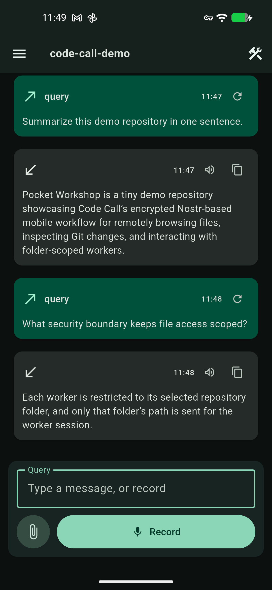
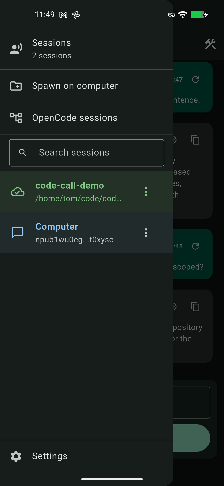
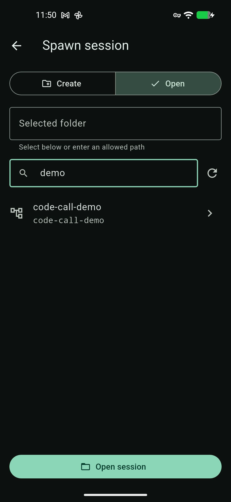
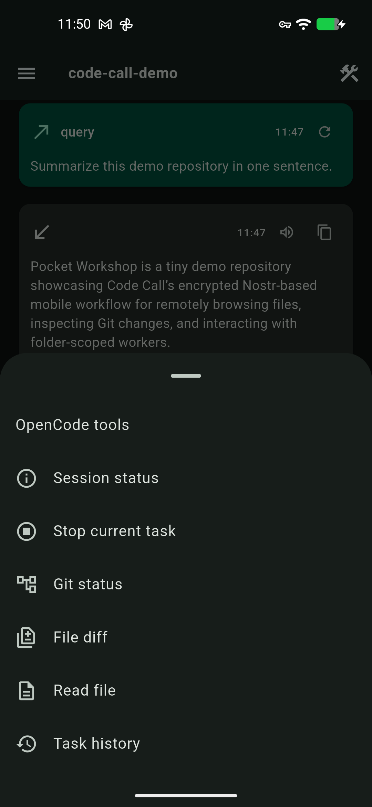
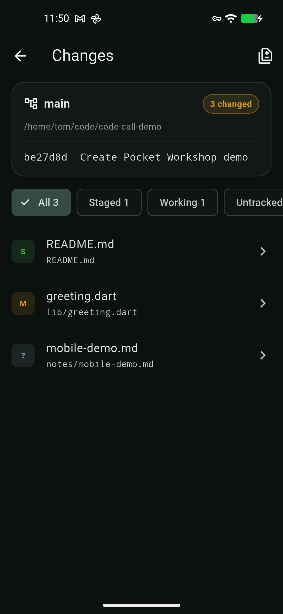
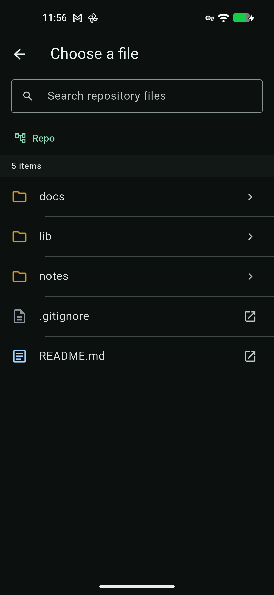
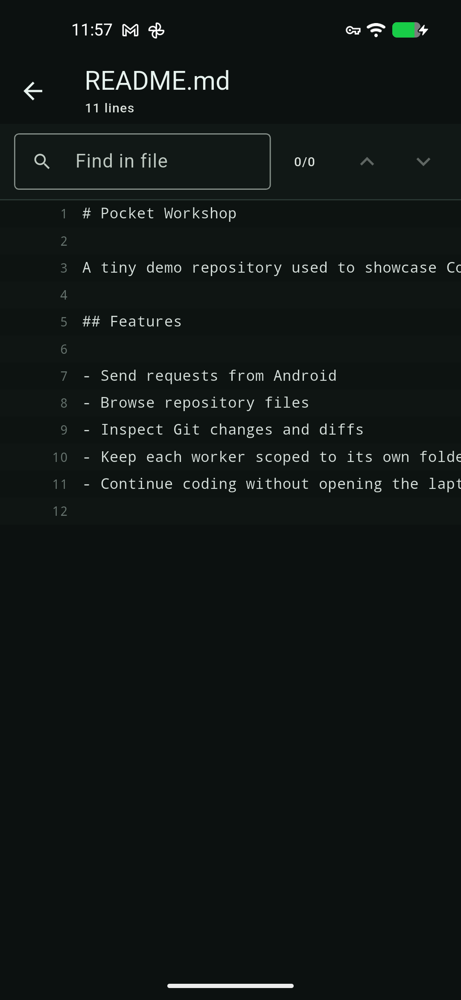
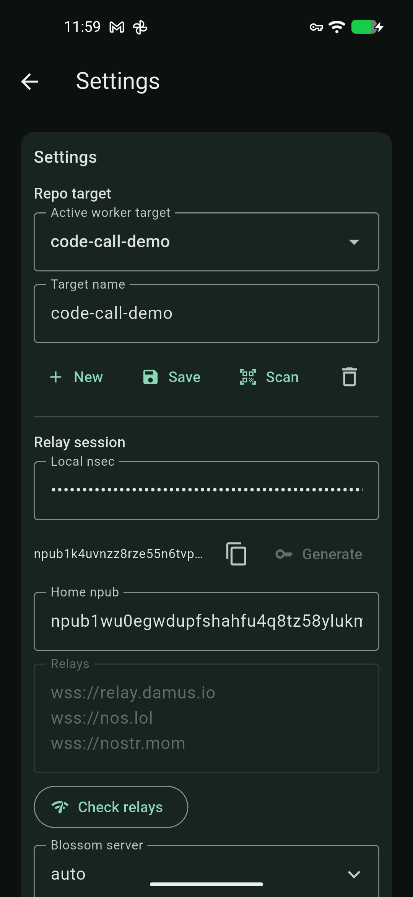
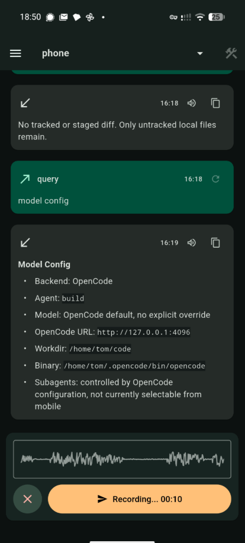

# Code Call

Encrypted collaborative workspace and remote client for OpenCode.

Code Call connects Android and Linux clients to an OpenCode worker on your computer through encrypted Nostr GiftWrapped DMs. It combines persistent team channels, direct messages, conversation agents, repository tools, voice and media, and peer-to-peer calls with focused repository sessions for individual work.

## Core Capabilities

- **Collaborative workspace:** persistent channels and direct messages for people and OpenCode agents, with Markdown, attachments, reactions, unread state, threads, and copyable text.
- **Conversation agents:** attach named agents to a conversation, mention them to route work, configure their model, execution profile, working folder, and restart behavior, and inspect session health and token usage.
- **Scoped agent work:** set a durable agent brief and a folder scope for each conversation. Agent replies remain in the originating thread.
- **Repository access:** switch or spawn repository sessions, inspect Git status and diffs, browse worker files on demand, and preview file content beside the conversation or in a full workspace view.
- **Voice, media, and calls:** send Whisper-transcribed voice and encrypted attachments through Blossom, or make STUN-only peer-to-peer direct and channel calls with optional camera or screen-share video.
- **Focused remote control:** request status, stop active tasks, inspect history and model configuration, prepare commits, and start release workflows without opening a laptop.

## Screenshots

These focused-session screens were captured from a Pixel 5 connected to a temporary `code-call-demo` worker. The conversation, OpenCode session, repository files, and Git changes are real; no UI data was mocked.

| Encrypted chat | Session drawer | Spawn session |
| --- | --- | --- |
|  |  |  |

| OpenCode tools | Git status | Repository browser |
| --- | --- | --- |
|  |  |  |

| File viewer | Settings |
| --- | --- |
|  |  |

| Voice recording |
| --- |
|  |

## Team Workspace

The workspace is a collaboration surface for people and OpenCode agents, not a stream of transient prompts. Channels and direct messages retain their history on the worker. Messages support Markdown tables, attachments, reactions, thread replies, and selectable text. Hashtags can provide a fallback thread topic. Mentions offer only the people and agents who participate in the current conversation.

Each conversation can have a short agent brief and a folder scope. The brief is prepended to the request that an attached agent receives. A folder scope limits the repositories and folders the agent is told to work in. Leaving the scope empty does not add an artificial folder restriction.

Agents are configured from the workspace: create, rename, restart, delete, set the OpenCode execution profile and model, select a working folder, and choose whether the worker restarts a failed dedicated session. Agent details show the live session, initialized time, provider/model, and cumulative token usage when OpenCode exposes that data.

Channels include a repository Files action. The Files panel loads one directory at a time to remain reliable over encrypted relay messages. It shows the current folder, provides an Up folder control, and never relies on a partial recursive directory index. It shares the right-hand workspace panel with threads, offers Thread and Files tabs when both are open, previews selectable file content in place, and can expand to fill the workspace.

## Clients and Focused Sessions

The focused-session view is a remote repository workspace with a composer at the bottom. Type in the query box and tap send, or leave it empty and tap `Record` for a voice request. The attachment button sends encrypted media/file references.

The session drawer contains:

- Saved repo sessions.
- Session pin/unpin.
- Recent-first session ordering.
- Session search.
- `Spawn on computer` opens a full-screen Create/Open selector with folder search and a large repository list.
- Settings for keys, relays, Blossom, speech, haptics, and profile import/export.

The Tools button in the top bar is enabled once connected. It sends optional worker requests instead of dumping details inline by default:

- `Session status`
- `Stop current task`
- `Git status`
- `File diff`
- `Read file`
- `Task history`
- `Model config`
- `Commit prep`
- `Release workflow`

Git status, file diffs, and file content open in dedicated mobile views:

- Git status groups changed files into staged, working, and untracked filters.
- Diff view provides a changed-file picker, previous/next navigation, line numbers, and colored additions/deletions.
- Read File opens a repository browser for readable files with folders, breadcrumbs, search, and file-type icons.
- File view provides line numbers, horizontal/vertical scrolling, selectable text, and find-in-file navigation.

The browser layout and file contents are returned as structured NIP-17/NIP-59 GiftWrapped DMs. Directory entries are capped by serialized payload size, and file content is truncated for reliable relay delivery; files are not uploaded to Blossom for these views.

## Security Model

- Text, transcripts, responses, attachment URLs, and decryption keys are inside NIP-17/NIP-59 encrypted GiftWrapped DMs.
- Blossom uploads are public blobs, but the uploaded payload is encrypted locally before upload.
- The worker authorizes configured accepted peers and persisted workspace members. New members join through an invitation; first-owner pairing requires both the QR secret and its six-digit confirmation code.
- SQLite memory, if enabled, is local to the worker and contains decrypted request/response history.

## Install Clients

Download the latest APK from GitHub Releases:

```text
https://github.com/tidley/nostr-codex-phone/releases
```

Install on Android, then scan the worker QR code or paste the worker target details in Settings. Linux and Windows desktop clients can be built with `flutter build linux --release` and `flutter build windows --release`; pushes to `main` publish the web client to GitHub Pages, while Windows releases remain a manual workflow. The release workflow also builds an Apple Silicon macOS worker. A macOS client release needs Apple signing and notarization before it can be distributed outside a development environment. Keep each client and its worker on the same release version so structured tool views use the same wire contract.

## Start A Worker

From the directory you want to use as the worker root:

```bash
curl -fsSL https://raw.githubusercontent.com/tidley/nostr-codex-phone/main/scripts/bootstrap-worker.sh | bash
```

The worker writes state under `.nostr-codex/`, including `.env.server`, `target.svg`, `target.txt`, `workers.json`, `worker.lock`, and optional `memory.sqlite3`.

On startup it prints/saves a QR target card. Scan it from the phone to add the computer service or repo session.

The confirmation code is `SHA-256("nostr-codex/first-owner-confirmation/v1" || 0x00 || UTF-8(pairing_secret))`: interpret the first four digest bytes as an unsigned big-endian integer and take modulo `1,000,000`, zero-padded to six digits. The QR SVG and target payload contain the pairing secret and are saved with Unix mode `0600`.

## Worker Configuration

Common `.nostr-codex/.env.server` values:

```bash
NOSTR_SECRET_KEY='nsec...optional worker key...'
NOSTR_PEER_PUBKEY='npub...phone public key...'
NOSTR_RELAYS='wss://relay.damus.io,wss://nos.lol,wss://nostr.mom,wss://relay.primal.net,wss://purplepag.es'

AGENT_BACKEND='opencode'
OPENCODE_BIN='opencode'
OPENCODE_AGENT='build'
OPENCODE_MODEL='provider/model-id'
AGENT_WORKDIR='/path/to/repo'

TRANSCRIBE_BIN='/home/user/.local/bin/whisper-cpp'
TRANSCRIBE_ARGS='-m /path/to/ggml-base.en.bin -f {audio} -otxt -of {output_dir}/transcript -nt'
```

The worker uses the local `opencode` CLI directly. It runs `opencode run --format json --dir ... --session ... --agent ...`; no `OPENCODE_URL` or OpenCode HTTP server is required.

## Development

Run the app:

```bash
flutter run
```

Run the worker:

```bash
cargo run --manifest-path rust/Cargo.toml --bin nostr-codex-server
```

### Direct Pixel FIPS Call Test

Run the real desktop-to-Pixel FIPS/Opus harness with the instructions in
[`docs/fips-call-harness.md`](docs/fips-call-harness.md). It emits one
pass/fail JSON result and never substitutes an Android simulator.

### In-Call Video Sources

Active FIPS calls start audio-only. The in-call controls can switch the shared
H.264 fragment stream between camera video and screen share without ending the
call or interrupting call audio. Android screen sharing uses the system
MediaProjection permission prompt. Linux screen sharing uses `ffmpeg` with
`x11grab` and requires an X11 `DISPLAY` plus an ffmpeg build with `x11grab` and
`libx264`. Wayland is deliberately not supported: screen capture there requires
a desktop portal/PipeWire permission flow, which cannot be replaced safely by
an ffmpeg display source. Linux camera capture continues to use V4L2 and
`NOSTR_CODEX_CAMERA` (default `/dev/video0`).

### Deploy A Local Worker Build

`cargo build --release` writes the worker to `rust/target/release`; it does
not update an installed systemd worker. After worker source changes, build and
deploy with:

```bash
cargo build --release --manifest-path rust/Cargo.toml --bin nostr-codex-server
./scripts/deploy-local-worker.sh
```

The deploy script confirms that the systemd user service executes the target
path, stages the release binary in a versioned directory, atomically switches
the service path, verifies matching SHA-256 checksums, and restarts the
service. It restores the previous binary if the restart fails. Set
`CODEX_WORKDIR` or `NOSTR_CODEX_WORKER` when the worker state is outside the
repository's parent directory.

The deploy script needs access to the worker user's DBus session. It sets these
values automatically when `/run/user/$(id -u)/bus` is available:

```bash
export XDG_RUNTIME_DIR="/run/user/$(id -u)"
export DBUS_SESSION_BUS_ADDRESS="unix:path=$XDG_RUNTIME_DIR/bus"
```

If that socket is unavailable, the script stops before copying the binary and
reports that manual deployment from the worker user's desktop session is
required.

### Verified Worker OTA Updates

`install-worker-service.sh` installs a daily systemd user timer. The timer
downloads `worker-update.json` and its Minisign signature, verifies the
pinned public key and worker SHA-256, stages the binary in
`.nostr-codex/releases/`, atomically switches the stable worker path, and
observes the service for 30 seconds. If the updated service fails, it switches
back to the previous binary and restarts it.

OTA updates are disabled until the worker environment contains the distributor
public key. Add this to `.nostr-codex/.env.server` before installing the
service, using a public key obtained through a trusted channel:

```bash
NOSTR_CODEX_UPDATE_PUBLIC_KEY='RWQ...minisign-public-key...'
# Optional: use a private release mirror instead of GitHub Releases.
# NOSTR_CODEX_UPDATE_URL='https://updates.example.com/code-call'
```

Build release metadata with a Minisign secret key:

```bash
NOSTR_CODEX_UPDATE_SIGNING_KEY=/secure/path/worker-update.key \
  scripts/package-release-assets.sh
```

Upload `nostr-codex-worker-linux-x64`, `worker-update.json`, and
`worker-update.json.minisig` to the same release. Check or apply an update
manually with:

```bash
<workspace>/.nostr-codex/bin/update-worker.sh --check
<workspace>/.nostr-codex/bin/update-worker.sh --apply
```

Use `systemctl --user disable --now nostr-codex-update.timer` to turn off
automatic checks. The updater never activates unsigned metadata.

Verify:

```bash
flutter analyze
cargo test --manifest-path rust/Cargo.toml -- --test-threads=1
flutter build apk --release
```

Package release assets:

```bash
cargo build --release --manifest-path rust/Cargo.toml --bin nostr-codex-server
scripts/package-release-assets.sh
```
